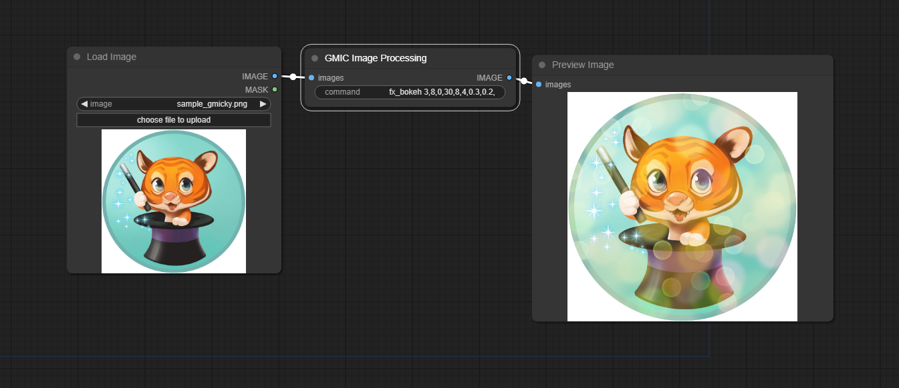
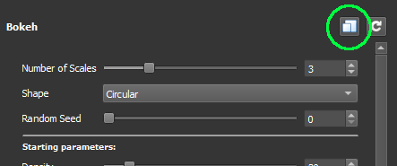

# G'MIC in ComfyUI

## Quick Start

* Install custom node with: `git clone https://github.com/gemelli/ComfyUI_GMIC`  
or copy [gmic.py](https://github.com/gemelli/ComfyUI_GMIC/raw/main/comfy_gmic.py) file to custom nodes folder
* Download [G'MIC Command-line interface (CLI)](https://gmic.eu/download.html)
* Put executable path in your PATH ([how to](https://windowsloop.com/how-to-add-to-windows-path/))
* Download [G'MIC-Qt stand-alone interface](https://gmic.eu/download.html)
* Choose a filter and copy the command  

* Paste the command to the custom node

---
Tested on Windows10, Comfyui [248aa3e](https://github.com/comfyanonymous/ComfyUI/tree/248aa3e56355d75ac3d8632af769e6c700d9bfac), G'MIC cli 3.2.4

**TODO**:  
[ ] Batch image  
[ ] Favorites drop-down for easier usage

---
Other Image Processing ComfyUI custom nodes:  
* [ComfyUI-Allor](https://github.com/Nourepide/ComfyUI-Allor): ComfyUI plugin for image processing and work with alpha chanel
* [ComfyUI-post-processing-nodes](https://github.com/EllangoK/ComfyUI-post-processing-nodes): A collection of Post Processing Nodes for ComfyUI, which enable a variety of cool image effects
* [ComfyI2I](https://github.com/ManglerFTW/ComfyI2I): ComfyI2I is a set of custom nodes for ComfyUI that help with image 2 image functions
* [ComfyUI\_ImageProcessing](https://github.com/bvhari/ComfyUI_ImageProcessing): ComfyUI custom nodes to apply various image processing techniques
